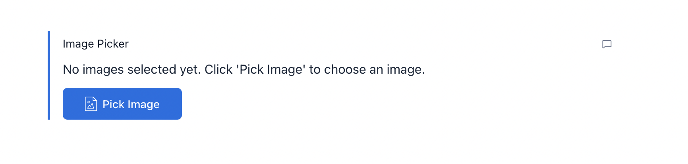
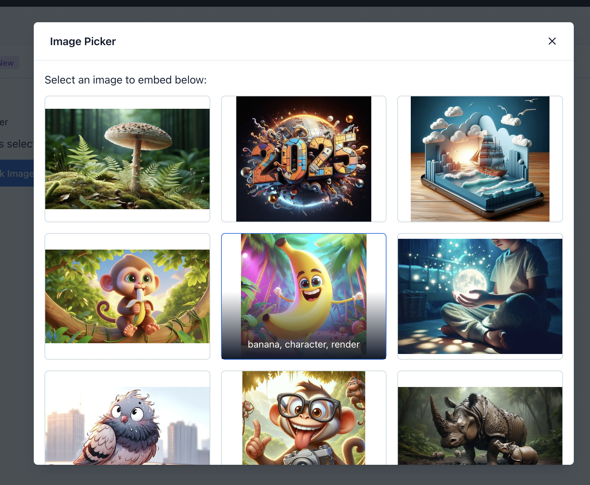
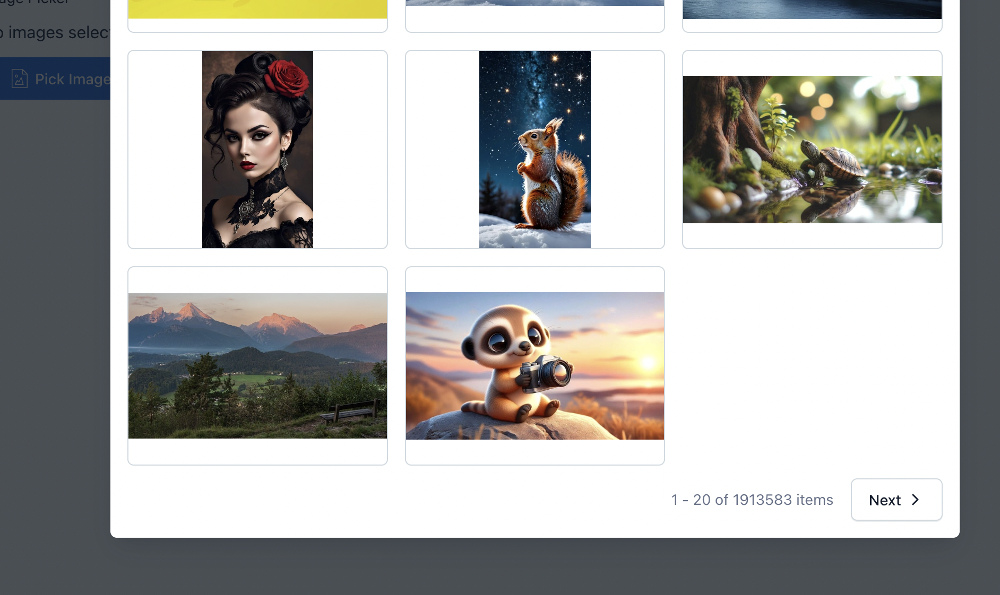
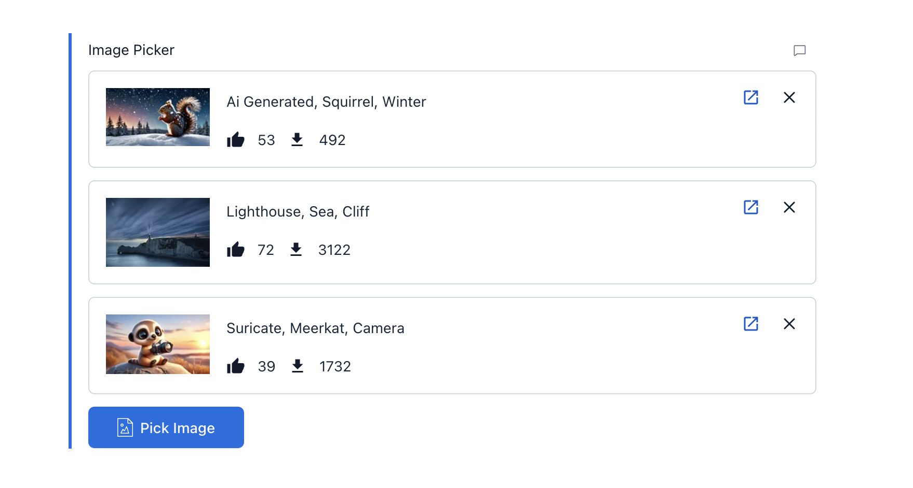

# Contentful Pixabay Image Picker

## Description
This app is built on the **Contentful app framework** and allows Contentful editors to easily select, and embed images from **Pixabay** into Contentful entries. The app is a **field-level** app that provides a seamless experience for attaching and managing images within Contentful.

## Screenshots

### 1. Pick Image button


### 2. Image picker dialog


### 3. Pagination 


### 4. Preview card of selected image 


## Features

### 1. Image Selection from Pixabay
- **Browse**: Editors can open a dialog to browse Pixabay’s image catalog.
- **Single Image Selection**: After browsing the catalog, editors can select a single image to embed into the Contentful entry.
- **Attach Image**: The selected image's data (either a URL or the full JSON response) is stored in the associated Contentful field.
- **Preview**: Once attached, the image is displayed within the field for preview purposes.

### 2. Remove or Replace Image
- **Remove Image**: Editors can remove the currently attached image and select a new one if necessary.

### 3. Multiple Image Selection
- **Multiple Image Attachments**: Editors have the option to attach and manage multiple images for a single entry.

### 4. Unit tests (Dev)
- **Added unit tests**: Unit tested files associated with image picker app.

## Workflow
1. **Open Entry**: Editors open an entry in Contentful that contains a specific field designed for embedding images.
2. **Open Image Picker**: Click the button in the field to open a dialog for selecting images from Pixabay.
3. **Browse and Select**: Browse the Pixabay image catalog, select an image, and confirm the selection.
4. **Display Image**: The selected image is displayed in the field for preview.
5. **Replace or Remove**: Editors can remove the selected image or replace it by selecting a new one.

## Technical Details

### Contentful Integration
- **Field-Level App**: The app integrates at the field level, allowing users to browse the Pixabay image catalog and embed functionality directly within the Contentful entry editor.
- **Data Storage**: Image data is stored as JSON. It shows image as preview card which includes tags, remove image icon, open image in other tab icon, likes and downloads information.
- **Content Type Setup**: Content type with a **JSON field**.

### Tools and Libraries Used
- **create-contentful-app**: Used for scaffolding and deploying the app.
- **Pixabay API**: Integrated Pixabay API for image search and selection.
- **Contentful SDK**: Contentful app framework SDK for embedding the app within the Contentful entry editor.

## Setup Instructions

### Prerequisites
- **Node.js** (v16 or higher)
- **Contentful account**: [Sign up here](https://www.contentful.com/sign-up)
- **Pixabay account**: [Sign up here](https://pixabay.com/accounts/register)

## Available Scripts

In the project directory, you can run:

For the below commands to work, the following environment variables must be set either as .env file or node environment variables:

- `CONTENTFUL_ORG_ID` - The ID of your organization
- `CONTENTFUL_APP_DEF_ID` - The ID of the app to which to add the bundle
- `CONTENTFUL_ACCESS_TOKEN` - A personal [access token](https://www.contentful.com/developers/docs/references/content-management-api/#/reference/personal-access-tokens)

- `REACT_APP_PIXABAY_API_KEY` - Pixabay API key once you sign up you will get the key.

- `REACT_APP_PIXABAY_API_URL` - https://pixabay.com/api/
  
### Installation
1. Clone the repository:
   ```bash
   git clone <repository-url>
   cd contentful-pixabay-app


2. Install dependencies:

   ```bash
   npm install
   # or
   yarn install

3. Start the application 

   ```bash
   npm start
   # or
   yarn start
- This command creates or updates your app definition in Contentful, and runs the app in development mode.
- Open your app in the browser to view it.
- The page will reload if you make edits.
- You will also see any lint errors in the console.

4. Build the App for Production:
   
   ```bash
      npm run build
      # or 
      yarn run build
      ```
- Builds the app for production to the build folder.
- React is bundled in production mode and the build is optimized for the best performance.
- The build is minified, and filenames include hashes. Your app is now ready to be deployed!   

5. Upload the App to Contentful

```bash
   npm run upload
   # or 
   yarn run upload
   ```
- Uploads the `build` folder to Contentful and creates a bundle that is automatically activated.
- The command guides you through the deployment process and asks for all required arguments.
- For more information about the deployment process, please refer to the official documentation.

```bash
   npm run upload-ci
   # or 
   yarn run upload-ci
   ```
- Similar to `npm run upload`, this command uploads your app to Contentful and activates it.
- The difference is that all required arguments are read from the environment variables, making it suitable for CI pipeline integration.


## Libraries to use

To make your app look and feel like Contentful use the following libraries:

- [Forma 36](https://f36.contentful.com/) – Contentful's design system
- [Contentful Field Editors](https://www.contentful.com/developers/docs/extensibility/field-editors/) – Contentful's field editor React components

```js
// Use the client
cma.locale.getMany({}).then((locales) => console.log(locales));
```

Visit the [`contentful-management` documentation](https://www.contentful.com/developers/docs/extensibility/app-framework/sdk/#using-the-contentful-management-library)
to find out more.

## Learn More

[Read more](https://www.contentful.com/developers/docs/extensibility/app-framework/create-contentful-app/) and check out the video on how to use the CLI.

Create Contentful App uses [Create React App](https://create-react-app.dev/). You can learn more in the [Create React App documentation](https://facebook.github.io/create-react-app/docs/getting-started) and how to further customize your app.
